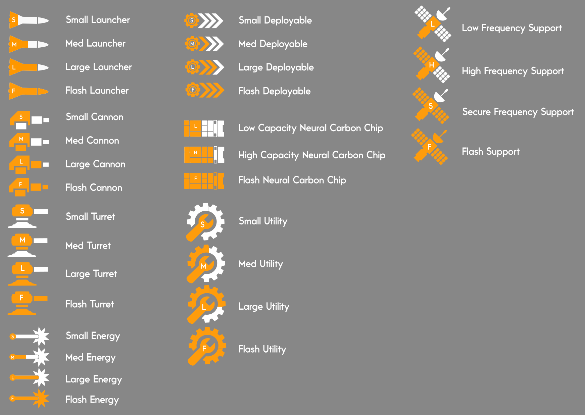

# Advent.Guard

## Attachments Main

In Advent Guard each exoskeleton can be retrofitted with an assortment of Attachments so the player can completely set up their loadouts to their playstyle. 

Attachments generally fall under one of these types:

**Launchers** 
Launchers are usually front-facing slots that fire various types of missiles. Could be manual or lock on aiming.

**Cannons**
Cannons are usually arm/side based slots (but could overlap with launcher compatibility, e.g. a front slot could be compatible with both a small launcher or a small cannon attachment) and are smaller caliber projectile based weapons, usually a very high rate of fire but generally manual aiming.

**Turrets**
Usually top/upwards facing slots (e.g. top of head or large shoulders), these pop up and can rotate a full 360 degrees and can automatically lock on to enemies, some with auto-firing.

**Energy**
Most likely compatible on front/top side facing slots, these weapons pop out and can fire energy based ammo. Railguns, pulse weapons would fall under energy. These could be manual or automatic locking in advanced attachments.

**Deployables**
Front or Back Facing slots where something comes out of the exoskeleton that has its OWN functionality. This could be mines, deployable shields, even real-time grappling hook.

**Support**
This is an internal slot with no physically shown attachment (other than when picking up from the world). that calls external support. It could be an attachment that calls for a repair or to repair a teammate, an overhead bombing run, or an orbital strike. This could even be calling in other exoskeletons from yours/teams arsenal.

**Utility**
Utility attachments are also internal with no physically shown attachment. These attachment provide an internal function for the player or perhaps team. Resource scanners, enemy scanners, enemy shield disruptors, cloaking devices would be utility attachments.

**Chips**
Chips are internal upgrades for the exoskeletons also with with no physically shown attachment at run-time. These can upgrade speed, firing rate, damage amplifiers, anything really.

These attachments are fitted into large mechanical exoskeletons which have varying types of slots depending on the exo chassis. Each attachment the player crafts or loots in the world has a compatible slot type(s) that will let the user know where they can insert the attachment on the exoskeleton. The slot sizes and types are:

